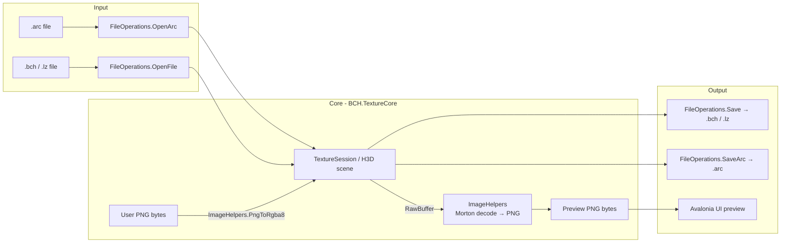

# Architecture — BCH Texture Editor

## System Overview

BCH Texture Editor is a cross-platform desktop application for editing Nintendo 3DS Fire Emblem texture files. It follows a **headless core / thin UI shell** pattern: all file-format and image-processing logic lives in `BCH.TextureCore` (a UI-free .NET 8 class library), and the UI layer (`BCH.TextureTool.Avalonia`) is a thin Avalonia shell that calls the core's byte[]-based API and displays results. A legacy WinForms app (`BCH Texture Tool/`) shares the same domain but is Windows-only and is not a CI deliverable.

The pixel encoding pipeline is the most domain-specific part: Nintendo's PICA200 GPU stores textures in RGBA8 format with Morton (Z-order) swizzle tiling of 8×8 pixel blocks, bottom-to-top, with dimensions rounded down to powers of 2. All encode/decode logic is isolated in `ImageHelpers.cs`.

## Pipeline

## Module Registry

<!-- AUTO:START section=module-registry -->
| Path | Responsibility | Invariants |
|---|---|---|
| `BCH.TextureCore/TextureSession.cs` | Domain object wrapping an `H3D` scene. All texture CRUD operations (import, export, replace, rename, remove). Byte[]-only API. | Never references UI frameworks. Names sanitised (no spaces) and deduplicated on write. |
| `BCH.TextureCore/FileOperations.cs` | Static methods for opening and saving BCH, LZ, and ARC files. Byte[]-only. | `OpenFile` returns `null` on non-BCH or scene-with-models input. `Save` throws on `.arc` format (use `SaveArc`). |
| `BCH.TextureCore/ImageHelpers.cs` | PICA200 RGBA8 Morton swizzle encode/decode. PNG split/merge alpha. SixLabors.ImageSharp only. | Encodes `[A,R,G,B]` per pixel (PICA200 order). Decodes with vertical flip (PICA200 is bottom-to-top). Dimensions rounded to power-of-2 on encode. |
| `BCH.TextureTool.Avalonia/MainWindow.axaml.cs` | All UI event handlers. Calls TextureCore via `_session`. Async I/O only (never blocks UI thread). | UI state (`_session`, `_saveExt`) is the single source of truth for enabled/disabled controls. |
| `BCH.TextureTool.Avalonia/InputDialog.cs` | Modal text-input dialog for texture rename. | Returns `null` on cancel. |
| `BCH.TextureTool.Avalonia/Program.cs` | App entry point. Registers `CodePagesEncodingProvider` (Shift-JIS / cp932) before any Avalonia or FE3D call. | Must be first call in `Main`. |
| `libs/FE3D.dll` | LZ11/LZ13 compression; `FEIO` utility (magic bytes, etc.). Vendored, AnyCPU managed IL. | Patched for Shift-JIS string encoding (see `patches/`). |
| `libs/FE3D.Graphics.dll` | SPICA H3D/BCH parser; `FEArcOld` ARC archive read/write. Vendored, AnyCPU managed IL. | Patched for Shift-JIS string encoding (see `patches/`). |
<!-- AUTO:END -->

## Design Decisions

1. **Headless core library (`BCH.TextureCore`)**
   - Rationale: The original WinForms app used `System.Drawing` for image work, which is Windows-only. Extracting all logic into a UI-free library with a byte[]-based API allowed the Avalonia port to be written without touching the domain logic.
   - Alternatives considered: Port WinForms to cross-platform by replacing each `System.Drawing` call in-place (rejected — coupling between UI and domain was too tight).
   - Source: commit `39063cf`

2. **Vendored FE3D DLLs with Shift-JIS patch**
   - Rationale: Upstream SPICA used ASCII encoding for BCH string serialisation, corrupting all non-ASCII texture names (Japanese kanji) to `?` on save. The fix requires patching two files inside `FE3D.Graphics`. Rather than maintaining a fork, the patched DLLs are vendored in `libs/` with a `patches/` directory explaining how to rebuild them.
   - Alternatives considered: Upstream PR (not yet accepted); runtime string interception (too fragile).
   - Source: commit `596635d`, `patches/README.md`

3. **Morton swizzle implemented in managed code**
   - Rationale: SPICA's `H3DTexture(name, bitmap, RGBA8)` constructor relied on `System.Drawing.Bitmap`, unavailable on Linux. Re-implementing the PICA200 Morton swizzle in `ImageHelpers.cs` using `SixLabors.ImageSharp` removed the last Windows-only dependency from the core path.
   - Source: `BCH.TextureCore/ImageHelpers.cs:SwizzleLUT`

4. **Target `.csproj` directly; never the `.sln`**
   - Rationale: `BCH Texture Tool.sln` includes the legacy WinForms project, which has an unresolvable `ProjectReference` to the sibling `FE3D` repo. Building the solution on a clean checkout fails. All CI and publish commands target `BCH.TextureTool.Avalonia.csproj` directly.
   - Source: `specs/github-actions-build/PRD.md §4`

## Performance Contracts

- **ARC open**: no explicit bound; typical FE Fates ARC files are <5 MB and parse in <500 ms locally.
- **Preview decode**: single texture (256×256 RGBA8 = 262 KB raw) decodes to PNG in <50 ms on a modern CPU.

## Known Limitations

- **No test suite**: there are no automated tests. Correctness is verified manually against known-good ARC files.
- **Power-of-2 rounding**: images whose dimensions are not powers of 2 are silently downscaled on import. There is no warning.
- **Single-file self-extract temp dir**: the self-contained single-file executable extracts native blobs (Skia, HarfBuzz) to a temp directory on first launch. This fails on machines with non-executable temp partitions.
- **Legacy WinForms not in CI**: the `BCH Texture Tool/` project cannot be built on a clean checkout (missing sibling `FE3D` repo). It is local-build only.

## Change Log

<!-- AUTO:START section=change-log -->
- 2026-05-29 (feature github-actions-build): Add GitHub Actions CI — self-contained win-x64 / linux-x64 Avalonia builds + GitHub Release on tag push; bump ImageSharp to 3.1.11.
- 2026-05-28 (avalonia-port): Add BCH.TextureCore shared library and Avalonia cross-platform UI; fix Linux runtime crashes; fix Shift-JIS kanji texture name corruption.
<!-- AUTO:END -->
